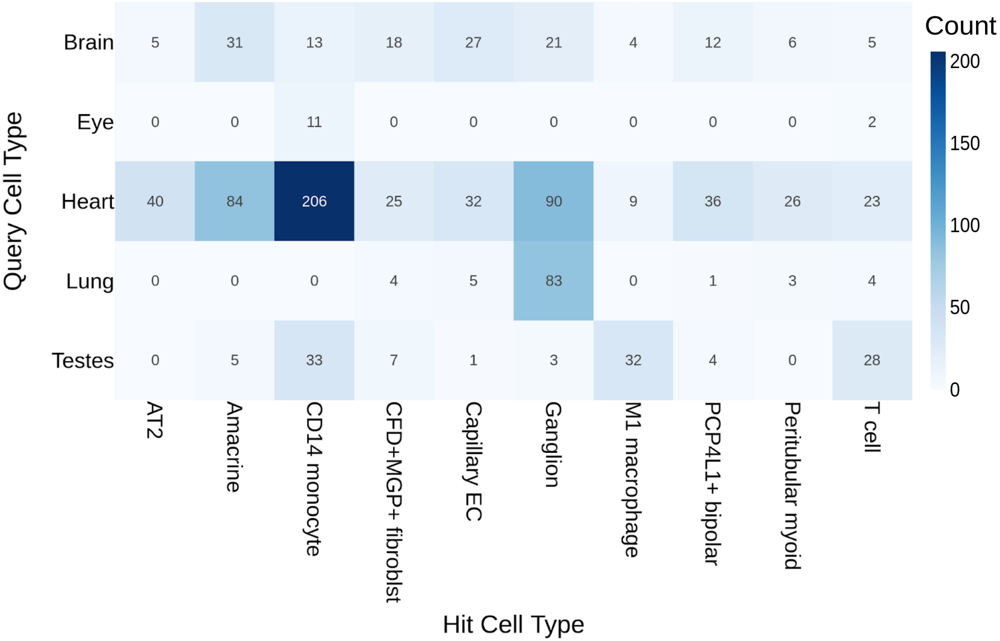
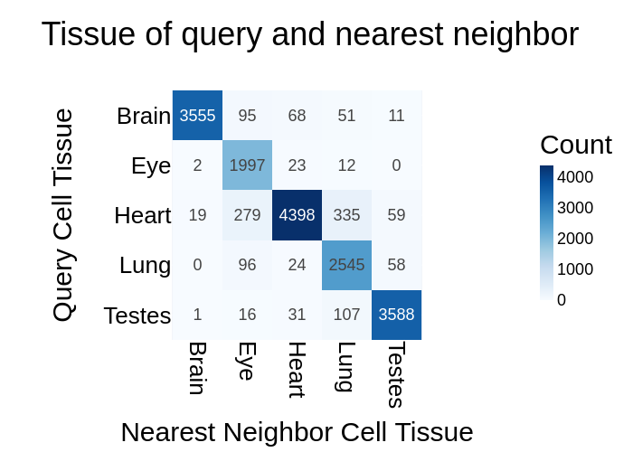
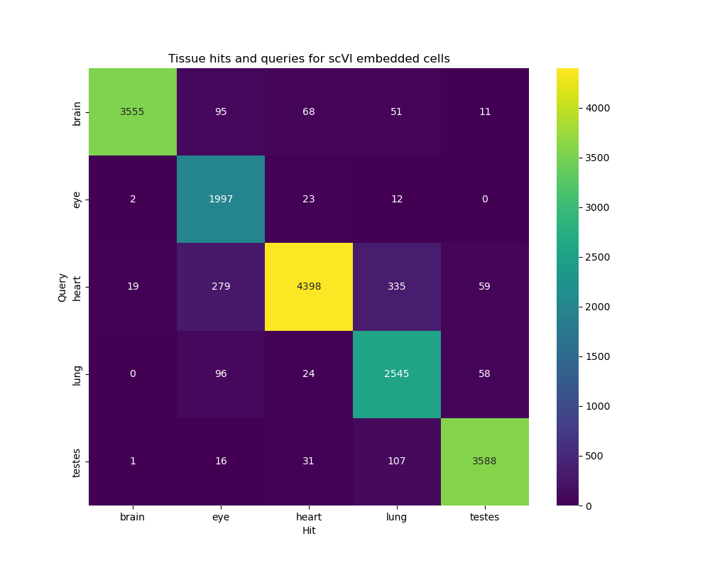

# scRNA-nn-search

1) Trained an scRNA (single-cell RNA) embedding model ([scVI](https://www.nature.com/articles/s41592-018-0229-2)) with cells from different datasets and tissues.

2) Built [FAISS](https://github.com/facebookresearch/faiss) vector database (DB) from training data.

3) Ran inference on new scRNA datasets.

4) Queried embeddings of new cells, unseen during training, against the cell embeddings in FAISS DB.

5) Evaluated search by counting tissue types of query cell and hit cell.

## Updates

### 01/17/2025
- Updated tissue search results heatmap
- Cell types of tissue mismatch between query and nearest neighbor

### 01/12/2025
Tissue search results
- query vectors: 17370
- db vectors: 14135
- vector dim: 500
- total search runtime: ~10 seconds
- average search runtime: ~0.006 seconds
- $k$=1 (nearest neighbor) 

Query/DB setup
| Tissue  | Query                                | DB                                  |
|---------|--------------------------------------|-------------------------------------|
| Brain   | brain.4341_BA24_10x.h5ad            | brain.1823_BA24_10x.h5ad           |
| Eye     | eye.GSM3745992.h5ad                 | eye.GSM3745993.h5ad                |
| Lung    | lung.GSM3926545.h5ad                | lung.GSM3926546.h5ad               |
| Heart   | heart.BO_H46_LV0_R2_premrna.h5ad    | heart.BO_H51_LV0_premrna.h5ad      |
| Testes  | testes.GSM3052919.h5ad              | testes.GSM3052918.h5ad             |

Data from DISCO
| Tissue  | X1                       | X2                       | Platform1 | Platform2 | Cell count 1 | Cell count 2 |
|---------|---------------------------|--------------------------|-----------|-----------|--------------|--------------|
| Brain   | 1823_BA24_10x            | 4341_BA24_10x           | 10x3'     | 10x3'     | 981          | 3780         |
| Heart   | BO_H46_LV0_R2_premrna    | BO_H51_LV0_premrna      | 10x3'     | 10x3'     | 5090         | 4387         |
| Eye     | [GSM3745992](#)          | [GSM3745993](#)         | 10x3'     | 10x3'     | 2034         | 2121         |
| Lung    | [GSM3926545](#)          | [GSM3926546](#)         | 10x3'     | 10x3'     | 2723         | 3297         |
| Testes  | [GSM3052918](#)          | [GSM3052919](#)         | 10x3'     | 10x3'     | 3349         | 3743         |

### 01/08/2025

Data for NN search
- CZ: https://cellxgene.cziscience.com/collections/854c0855-23ad-4362-8b77-6b1639e7a9fc
- ENCODE: https://www.encodeproject.org/matrix/?type=Experiment&control_type!=*&assay_term_name=single-cell+RNA+sequencing+assay&status=released&assay_title=snRNA-seq

| Tissue       | CZ           | ENCODE        |
|--------------|--------------|---------------|
| Heart        | 931k cells   | 49 studies    |
| Hippocampus  | 676k cells   | 49 studies    |
| Liver        | 259k cells   | 8 studies     |
| Pancreas     | 121k cells   | 6 studies     |
| Kidney       | 194k cells   | 1 study       |
| Blood        | 335k cells   | 0 studies     |

### 01/07/2025

Nearest neighbor (NN) search for with PCA and JL embeddings

| Model | Dimensions | Recall at top k=5       | KNN runtime (s=200) |
|-------|------------|-------------------------|---------------------|
| None  | 29898      | (Ground truth)          | 316.45             |
| PCA   | 3537       | 0.186                   | 27.23              |
| JL    | 3537       | 0.513                   | 28.73              |
